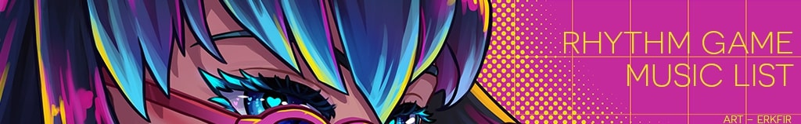

<div align="center">
  <br />
      
  <br />

  <h3 align="center">Rhythm Game Music List</h3>

   <div align="center">
     A collection of songs that can be used in rhythm games.
    </div>
</div>

## 📋 <a name="table">Table of Contents</a>

1. 🤖 [Introduction](#introduction)
2. 🌟 [Planned Features](#planned-features)
3. 🔋 [Features](#current-features)
4. 🤸 [Quick Start](#quick-start)

## <a name="introduction">🤖 Introduction</a>

# Rhythm Game Music List

**Rhythm Game Music List** is a community-driven platform designed to bridge the gap between rhythm game mappers and music artists. The website features a curated list of songs with explicit permission for use in rhythm games, making it easier for mappers to create legal and high-quality content while giving artists more opportunities to feature their work in rhythm games.

---

## <a name="planned-features">🌟 Planned Features</a>

### Core Functionality

- **Community-Curated Song List**: Explore a comprehensive database of songs that artists have explicitly permitted for use in rhythm games.
- **Detailed Licensing Information**: Filter songs by licensing terms, such as:
  - Commercial vs. non-commercial use
  - Content creator-friendly (e.g., Twitch/YouTube stream-safe)
  - Genre and other metadata
- **Artist Licensing Terms**: Artists can share public licensing information, removing the hassle of finding usage terms.

### For...

- **Rhythm Game Mappers**: Individuals or teams looking to map songs without legal concerns.
- **Artists**: Artists who want their music featured in rhythm games. They can list their songs, set terms of use, and gain exposure.

---

## 🚀 Stretch Goals

1. **Personalized Profiles**:
   - Mappers can showcase songs they’ve mapped.
   - A recommendation system based on mapping history.
2. **Artist Page Customization**:
   - Allow artists to add links for direct support (e.g., Ko-Fi, Patreon, Bandcamp).
3. **Game-Specific Filters**:
   - Find songs specifically allowed for mapping in chosen rhythm games.
4. **Artist-Driven Mapping Challenges**:
   - Artists can set challenges to inspire creativity in the community.
5. **Public API**:
   - Enable rhythm games to retrieve and use song data directly.
6. **Streamlined Artist Contact**:
   - Automatically generate and send licensing requests to artists, ensuring no duplicate outreach while simplifying the mapper’s workflow.

---

## 🎯 Goals

The platform aims to:

- **Empower Mappers**: Simplify the process of finding songs for rhythm game mapping while respecting artist rights.
- **Support Artists**: Provide exposure and promote fair usage of their music.

By combining detailed licensing information, community contributions, and tools for collaboration, **Rhythm Game Music List** seeks to become an indispensable resource for the rhythm game community.

---

## 🤝 Get Involved

This is a community-driven project, and we welcome contributions! Whether you're a developer, mapper, or artist, there's a way for you to get involved.

- **Developers**: Help build new features or improve existing ones.
- **Mappers**: Add music to the list and share insights on what makes the perfect mapper-friendly platform.
- **Artists**: Add your music and help shape how licensing is displayed.

---

## <a name="current-features">🔋 Current Features</a>

This project is in its early stages and was kickstarted from Javascript Mastery's 1 Million YouTube
Subscribers Hackathon. As such, only the current features are available:

👉 **Authentication**: Secure sign-in with NextAuth, supporting Email/Password, Google, and GitHub.

👉 **Home Page**: Displays songs with filters, search, and pagination for easy navigation.

👉 **Add a song**: Simple interface for adding new songs.

👉 **Responsive Design**: Fully optimized for a seamless experience on desktops, tablets, and mobile devices.

👉 **High Performance**: Fast loading and smooth interactions for an efficient user experience.

## <a name="quick-start">🤸 Quick Start</a>

Follow these steps to set up the project locally on your machine.

**Prerequisites**

Make sure you have the following installed on your machine:

- [Git](https://git-scm.com/)
- [Node.js](https://nodejs.org/en)
- [npm](https://www.npmjs.com/) (Node Package Manager)

**Cloning the Repository**

```bash
git clone https://github.com/gavinongmh/rhythm-game-music-list
cd rhythm-game-music-list
```

**Installation**

Install the project dependencies using npm:

```bash
npm install
```

**Set Up Environment Variables**

Create a new file named `.env` in the root of your project and add the following content:

```env
# Mongodb
MONGODB_URI=

# Auth
AUTH_GOOGLE_ID=
AUTH_GOOGLE_SECRET=
AUTH_GITHUB_ID=
AUTH_GITHUB_SECRET=
AUTH_SECRET=
NEXTAUTH_URL=

```

Replace the placeholder values with your actual credentials. You can obtain these credentials by signing up on the respective websites

**Running the Project**

```bash
npm run dev
```

Open [http://localhost:3000](http://localhost:3000) in your browser to view the project.
