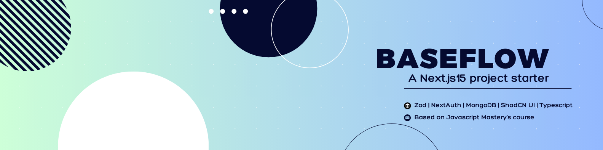

<div align="center">
  <br />
      
  <br />

  <div>
    
    
    
    
    
    
  </div>

  <h3 align="center">BaseFlow Project Starter</h3>

   <div align="center">
     A template project designed to kickstart your full-stack applications with a modern tech stack.
    </div>
</div>

## 📋 <a name="table">Table of Contents</a>

1. 🤖 [Introduction](#introduction)
2. ⚙️ [Tech Stack](#tech-stack)
3. 🔋 [Features](#features)
4. 🤸 [Quick Start](#quick-start)

## <a name="introduction">🤖 Introduction</a>

BaseFlow is a comprehensive starter template designed to kickstart your full-stack applications with a modern tech stack. It is based on JavaScript Mastery's Ultimate Next.js Course and serves as a clean foundation for building scalable web apps. Whether you're working on a personal project or a production-grade application, BaseFlow provides all the essential features and tools to get started efficiently.

The project uses MongoDB for a robust database layer, NextAuth (Auth.js) for versatile authentication options (Email/Password, GitHub, Google), and sleek styling with TailwindCSS and ShadCN UI.

## <a name="tech-stack">⚙️ Tech Stack</a>

BaseFlow leverages the following technologies:

- **[Next.js](https://nextjs.org/):** Server-side rendering and static site generation.
- **[TypeScript](https://www.typescriptlang.org/):** Strongly typed JavaScript for better developer experience.
- **[Tailwind CSS](https://tailwindcss.com/):** Utility-first CSS framework.
- **[MongoDB](https://www.mongodb.com/):** Flexible and scalable NoSQL database.
- **[ShadCN UI](https://ui.shadcn.dev/):** Modern, reusable UI components.

## <a name="features">🔋 Features</a>

👉 **Authentication**: Secure sign-in with NextAuth, supporting Email/Password, Google, and GitHub.

👉 **Home Page**: Displays songs with filters, search, and pagination for easy navigation.

👉 **Organized Layout**: Organized layout with popular questions and tags in view.

👉 **Make a song**: Simple interface for making new songs.

👉 **Global Search**: Find content across questions, users, tags, and more.

👉 **Responsive Design**: Fully optimized for a seamless experience on desktops, tablets, and mobile devices.

👉 **High Performance**: Fast loading and smooth interactions for an efficient user experience.

and many more, including code architecture and reusability

## <a name="quick-start">🤸 Quick Start</a>

Follow these steps to set up the project locally on your machine.

**Prerequisites**

Make sure you have the following installed on your machine:

- [Git](https://git-scm.com/)
- [Node.js](https://nodejs.org/en)
- [npm](https://www.npmjs.com/) (Node Package Manager)

**Cloning the Repository**

```bash
git clone https://github.com/gavinongmh/baseflow.git
cd baseflow
```

**Installation**

Install the project dependencies using npm:

```bash
npm install
```

**Set Up Environment Variables**

Create a new file named `.env` in the root of your project and add the following content:

```env
# Mongodb
MONGODB_URI=

# Auth
AUTH_GOOGLE_ID=
AUTH_GOOGLE_SECRET=
AUTH_GITHUB_ID=
AUTH_GITHUB_SECRET=
AUTH_SECRET=
NEXTAUTH_URL=

```

Replace the placeholder values with your actual credentials. You can obtain these credentials by signing up on the respective websites

**Running the Project**

```bash
npm run dev
```

Open [http://localhost:3000](http://localhost:3000) in your browser to view the project.
